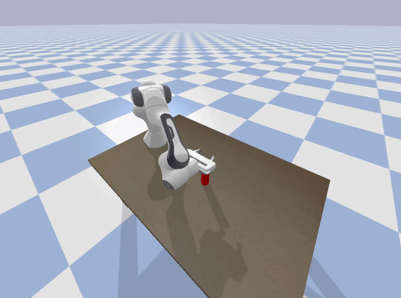

# HW10

Dylan Losey, Virginia Tech.

In this homework assignment we will implement an autoencoder and use latent actions.

## Install and Run

```bash

# Download
git clone https://github.com/vt-hri/HW10.git
cd HW9

# Create and source virtual environment
# If you are using Mac or Conda, modify these two lines as shown in [HW0](https://github.com/vt-hri/HW0)
# If you have previously created a virtual environment with torch, you can just source that environment
python3 -m venv venv
source venv/bin/activate

# Install dependencies
# If you are using Mac or Conda, modify this line as shown in [HW0](https://github.com/vt-hri/HW0)
pip install numpy pybullet torch

# Run the script
python get_dataset.py
```

## Expected Output



## Assignment

You are given code for implementing an autoencoder, and for using latent actions to control a robot arm.
The code is incomplete, and it is up to you to complete the code.
Complete the following steps:

1. Identify the elements of the state vector. Explain why each element is relevant for the given task. Why does closing the gripper act like a trigger to change the robot's motion?
2. Complete the model for the autoencoder. Train your resulting autoencoder, and use the decoder to control the robot's behavior in `test_policy.py`
3. Explore how user inputs affect the robot's behavior at run time. Try pressing `w`, `s`, and `x`. You can use `.` to terminate the simulation. Are we controlling this robot in end-effector space, or in joint space?
4. Modify the training parameters or dataset as neccesary to reach reasonable performance.
5. Imagine you wanted the user to be able to control whether the robot pushed the cylinder right or left. What changes would you need to make in the training data? How would these changes be reflected in the latent actions?
6. Modify the training data so that users can control whether the robot arm carries the cylinder right or left (or forward or back, your choice).